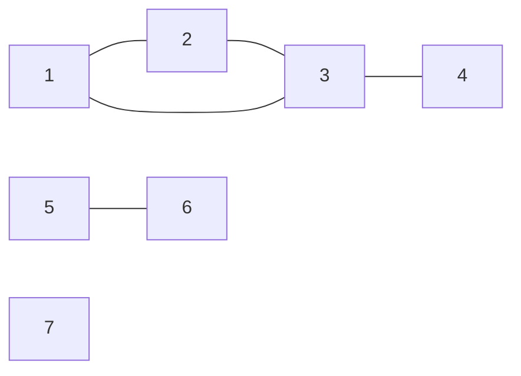
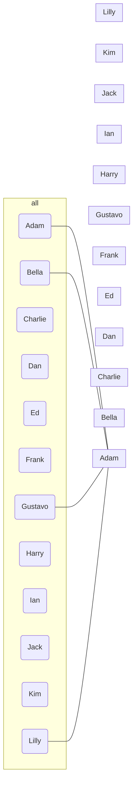

# discrete-math

Liam Muro \
Samantha Duong \
Discrete Math \
Quad Prep \
11th Grade \
2022 - 2023

## [Glossary](/Glossary/)

### [functions](/Glossary/functions/)

- [bijective-functions.md](/Glossary/functions/bijective-functions.md)
- [composite-functions.md](/Glossary/functions/composite-functions.md)
- [injective-functions.md](/Glossary/functions/injective-functions.md)
- [inverse-functions.md](/Glossary/functions/inverse-functions.md)
- [surjective-functions.md](/Glossary/functions/surjective-functions.md)

### [geometry](/Glossary/geometry/)

- [factorials.md](/Glossary/geometry/factorials.md)
- [permutations.md](/Glossary/geometry/permutations.md)

### [principles](/Glossary/principles/)

- [pidgeonhole-principle.md](/Glossary/principles/pidgeonhole-principle.md)

## [Notes](/Notes/)

### [2023](/Notes/2023/)

#### [January](/Notes/2023/01/)

- [January 04, 2023](/Notes/2023/01/2023-01-04.md)
- [January 09, 2023](/Notes/2023/01/2023-01-09.md)
- [January 10, 2023](/Notes/2023/01/2023-01-10.md)
- [January 11, 2023](/Notes/2023/01/2023-01-11.md)
- [January 17, 2023](/Notes/2023/01/2023-01-17.md)
- [January 18, 2023](/Notes/2023/01/2023-01-18.md)
- [January 24, 2023](/Notes/2023/01/2023-01-24.md)

#### [February](/Notes/2023/02/)

- [February 01, 2023](/Notes/2023/02/2023-02-01.md)
- [February 07, 2023](/Notes/2023/02/2023-02-07.md)
- [February 08, 2023](/Notes/2023/02/2023-02-08.md)
- [February 13, 2023](/Notes/2023/02/2023-02-13.md)
- [February 14, 2023](/Notes/2023/02/2023-02-14.md)

----

## Monday April 03, 2023

LCM Lowest Common Multiple

$$a = ({x}\bmod{b}) \\
a,b \in \Z \quad b>0 \\
q,r \quad 0\le r <b \\
a = qb+r \\
a \bmod b = r$$

----

## Monday, April 17, 2023

### Graph Theory

Definition: A graph is a pair $G = (V,E)$ where $V$ is a nonempty, finite set and $E$ is the set of two-element subsets of $V$.

ex. Let $G = (\set{1,2,3,4,5,6,7}, \set{\set{1,2},\set{1,3},\set{2,3},\set{3,4},\set{5,6}})$

The elements of $V$ are called vertices

The elements of $E$ are called edges

Definition: Let $G = (V,E)$ be a graph and let $u,v \in V$. We say $u$ is adjacent to $v$ provided that $\set{u,v} \in E$. The notation $u \sim v$ means $u$ is adjacent to $v$. We say that $u$ and $v$ are neighbors. The set of all neighbors of $v$ is called the neighborhood of $v$ and is denoted $N(v)$.

$N(v) = \set{u \in V : u \sim v}$.

Definition: Let $G = (V,E)$ be a graph and $v \in V$ The degree of $v$ is the number of edges with which $v$ is incident. The degree of $v$ is denoted $d_G(v)$ or $d(v)$

$$d(v) = |N(v)|$$

$$d(1) = 2 \quad (2) = 2 \quad d(3) = 3 \quad d(4) = 1 \quad d(5) = 1 \quad d(6) = 1 \quad d(7) = 0$$

$$\sum_{v \in v}{d(v)} = d(1) + d(2) + d(3) + d(4) + d(5) + d(6) + d(7) = 10 = 2|E|$$

        1(Adam) --- 2 & 7 & 12; 
        2(Bella) --- 3 & 6; 
        3(Charlie) --- 4 & 11;
        4(Dan) --- 5 & 10;
        5(Ed) --- 6 & 9; 
        6(Frank) --- 7; 
        7(Gustavo) --- 8; 
        8(Harry) --- 9 & 12; 
        9(ian) --- 10; 
        10(Jack) --- 11; 
        11(Kim) --- 12; 
        12(Lilly);

----

## Monday, April 24, 2023

### Graph Theory (cont.)

GRAPH THEORY VOCAB

$\Delta G$ = max degree \
$\delta G$ = min degree \
$V(G)$ = vertex set \
$E(G)$ = edge set \
$|V|$ = order \
$|E|$ = size \
$v$ = vertices \
$\epsilon$ = edges \
complete graph = all vertices are neighbors

Subgraph: \
Definition: Let $G$ and $H$ be graphs. We call $G$ a subgraph of $H$ provided that $V(G) \subseteq V(H)$ and $E(G) \subseteq E(H)$.

ex.
$$V(G) = \set{1,2,3,4,5,6,7,8} \\
E(G) = \set{\set{1,2},\set{2,3},\set{2,6},\set{3,6},\set{4,7},\set{6,8},\set{7,8}}$$

$$V(H) = \set{1,2,3,4,5,6,7,8,9} \\
E(H) = \set{\set{1,2},\set{1,4},\set{2,3},\set{2,5},\set{2,6},\set{3,6},\set{3,9},\set{4,7},\set{5,7},\set{6,8},\set{6,9},\set{7,8},\set{8,9}}$$

Definition: Let $G$ and $H$ be graphs. We call $G$ a spanning subgraph of $H$ provided that $G$ is a subgraph of $H$ and $V(G) = V(H)$

Edge deletion:

$H - e$ \
$V(H - e) = V(H)$ \
$E(H - e) = E(H) - \set{e}$

Vertex deletion:

$V(H - v) = V(H) 0 \set{v}$ \
and \
$E(H - v) = \set{e \in E(H) : v \notin e} \quad e \rightarrow \set{\epsilon{_1},\epsilon{_2}}$

Definition: Let $H$ be a graph and $A$ is a subset of the vertices of $H(A \subseteq V(H))$. The subset of $H$ induced on $A$ is $H[A]$ defined by
$$V(H[A]) = A$$
$$E(H[A]) = \set{\set{x,y} \in E[H] : x \in A, y \in A}$$

----

## Tuesday, May 01, 2023

### Graph Theory (cont..)

Let $G$ be a graph. Let $S$ be the subset of vertices $S \subseteq V(G)$. $S$ is called a clique provided that any two distinct vertices in $S$ are adjacent.  

$\omega (g)$ denotes the largest order clique number.

Let $G$ be a graph. A subset of vertices $S \subseteq V(G)$ is called an independent set provided that no two vertices are adjacent.

$\alpha (G)$ denotes the largest order of an independence number.

Let $G$ be a graph. The complement of $G$ denoted by $\overline G$ defined by
$$V(\overline{G}) = V(G)$$
$$E(\overline{G}) = \set{x \sim y, x \land y \in V(G) : x \neq y, x \sim y \notin E(G)}$$

----

## Tuesday, May 09, 2023

### Graph Theory (cont...)

Preposition: Let$G$ be a graph. A subset $V(G)$ is a clique of $G$ iff it is an independent set of $\overline{G}$.

$$\omega(G) = \alpha(\overline{G})$$
$$\alpha(G) = \omega(\overline{G})$$

Ramsay's Theorem

Prop. Let $G = (V,E), |V| \geq 6$. Then $\omega(G) \geq 3$ or $\omega(\overline{G}) \geq 3$

Among six people, there are three people where any two of them are friends or there are three such that no two of them are friends.

Proof: Let $v$ be a vertex of $G$. Consider $d(v) \geq 3$ or $d(v) > 3$

First consider $d(v) \geq 3$. This means $v$ has three neighbors, call them $x,y,z$. If an of (or more) of $xy, yz, xz$ is an edge of $G$, then $G$ contains a clique of size $3$, so $\omega(G) \geq 3$. However, if none of them are edges in $G$, then they are edges in $\overline{G}$. So $\omega(\overline{G}) \geq 3$.

Now we can consider $d(v) \leq 2$. So there are five neighbors in $G$, so there are at least three neighbors to which $v$ is not adjacent. Call them $x,y,z$. If all of $xy, yz, xz$ is in $G$, then we have a clique in $G$ of size $3$, so $\omega(G) \geq 3$. If not, then we have a clique of size $3$ in $\overline{G}$, so $\omega(\overline{G}) \geq 3$. $\square$

----

## Monday, May 15, 2023

### Graph Theory (cont....)

#### CONNECTION YAY

Definition: Let $G$ be a graph and $u,v \in V(G)$. We say $u$ is connected to $v$ provided that there is a $(u,v)$-path in $G$.
$$u \sim \dots \sim \dots \sim v$$

Q: Reflexivity: $u$ connected to $u$? \
A: Yes

Q: Symmetric: $(u,v)$-path same as $(v,u)$-path? \
A: Yes

Q: Transitive: $x \sim y, \quad y \sim z \implies x \sim z$\
A: Maybe

Lemma: Let $G$ be a graph and $x,y \in V(G)$. If there is an $(x,y)$-walk in $G$, then we have an $(x,y)$-path in $G$.

$$P = x \sim \dots \sim {?} \sim u * \sim \dots \sim u * \sim {??} \sim \dots \sim y$$

Proof: Suppose $*$. The length is a natural number. WOP there is a shortest walk, $(x,y)$-walk, call ut $P$.\
Suppose $P$ is not a $(x,y)$-path. Since it's not a path, there is a repeated vertex, call it $u$.\
We form a new walk, $P'$ by deleting $**$\
$\Rightarrow \! \Leftarrow$\
Therefore, $P$ is an $(x,y)$-path. $\square$

Theorem: Let $G$ be a graph. The is-connected-to relation is an equivalence relation on $G$.

Definition: A component of $G$ is a subgraph of $G$ induced onto the equivalence class of the is-connected-to relation on $V(G)$.

Definition: A graph is connected provided each pair of vertices is connected by a path.\
$\forall x,y \in V(G), \exists$ a $(x,y)$-path

Components: $G[\set{1,2,3,4}] \quad G[\set{5}] \quad G[\set{6,7}]$

Definition: Let $G$ be a graph. A vertex $v \in V(G)$ is called a cut vertex of $G$ provided that $G - v$ has more components than $G$.\
Similarly, an edge $e \in E(G)$ is a cut edge of $G$ provided that $G - e$ has more components than $G$

----

## Tuesday, May 16, 2023

### Graph Theory (cont.....)

#### TREES YAYAYAY

Def. A cycle is a walk of length at least $\ge 3$ in which the first and last vertex is the same. but no other vertex are repeated.

Def. Let $G$ be a graph. If $G$ contains no cycles, then we call it acyclic. Alternatively, we call it a forest.

Def. A tree is a connected, acyclic graph.  [connected forest]

Theorem: $G$ is a tree iff there is distinct path between any two vertices.

Proof: $G$ is a tree (it is connected and acyclic)\
For the sake of contradiction, assume there are two or more different $(a,b)$-paths.\
This would form a cycle, and as $G$ is a tree: 👉👈\
$\Rightarrow \! \Leftarrow$

Unique $(a,b)$-path\
Connected: $\forall x,y \in V(G)$, there is an $(x,y)$-path.\
Suppose that there is a cyclic subgraph. That means there are two distinct paths for a given $x,y$.\
But we have only unique $(x,y)$-paths.\
Because $G$ is connected and acyclic, it makes it a tree. $\square$

Theorem: Let $G$ be a connected graph. Then $G$ is a tree iif every edge of $G$ is a cut edge.

Def. A leaf of a graph is a vertex of degree 1. Also know as end vertices, pendant vertices.

Theorem: Every tree with at least two vertices has a leaf.

Proof: Let $T$ me a tree w/ at least two vertices.\
Let's look at the longest path in $T$, call it $P$.\
$P = v_0 \sim v_1 \sim \dots \sim v_l, \quad l \ge 1$\
We claim that $v_0$ and $v_l$ are leafs.\
SFC, $v_0$ is nt a leaf. $v_1$ is a neighbor. Let's say $x$ is another neighbor. $d(v_0) \ge 2$\
$P = v_0 \sim v_1 \sim \dots \sim x \sim v_0$ cannot exist\
$Q = x \sim v_0 \sim v_1 \sim \dots \sim v_0$ cannot exist as $Q$ is longer than $P$\
$\Rightarrow \! \Leftarrow$\
$\therefore v_0$ is a leaf. Same for $v_l$

----

## Wednesday, May 17, 2023

### Graph Theory (cont......)

#### rest of the TREES YAYAYAY

Prop: $T \in ⫪$ Let $v$ be a leaf. Then $T - v$ is a tree.

Proof: $T - v$ does not have a cycle because if it did, $T$ would have a cycle, which would contradict the definition of a tree. 👉👈

Let $P$ be an $(a,b)$-path that doesn't contain $v$.\
Since $T$ is connected, every edge is a cut edge.\
If we cut off the edge linking $v$ to the main component, $P$ still exists in $T - v$ because $d(v) = 1$, so there are no vertices in $P$ that are affected. $\square$

Theorem: Let $T \in ⫪$ with $n \ge 1$ vertices. Then $T$ has $n - 1$ edges.

Proof: Base case: $n = 1$ vertices, $n - 1 = 0$ edges

Inductive hypothesis: Suppose this is true for $n = k$ vertices. \
Let $T$ be a tree with $n = k + 1$ vertices\
We want to prove $T$ has $n-1 = k$ edges.\
Let $v$ be a leaf on $T$. Let $T' = T -v$\
We consider the case where $v$ is not a leaf. Then $T' = T - v$ will result in a disconnected graph, which is therefore not a tree.  
