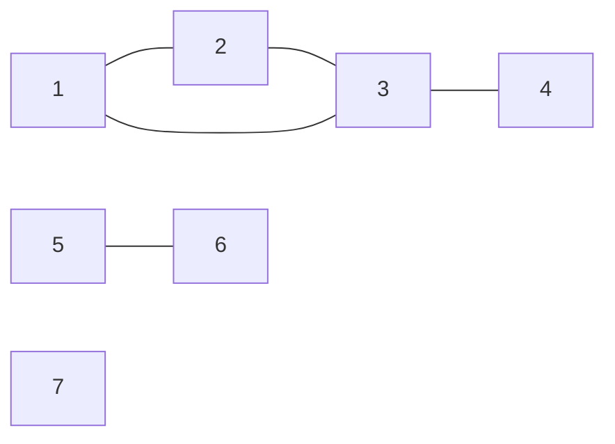
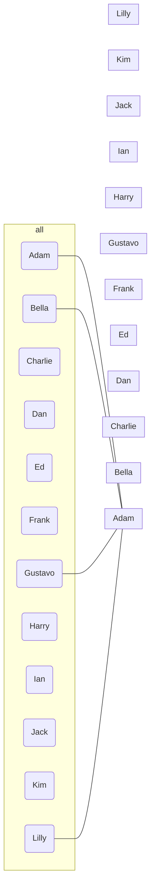

# discrete-math

Liam Muro \
Samantha Duong \
Discrete Math \
Quad Prep \
11th Grade \
2022 - 2023

## [Glossary](/Glossary/)

### [functions](/Glossary/functions/)

- [bijective-functions.md](/Glossary/functions/bijective-functions.md)
- [composite-functions.md](/Glossary/functions/composite-functions.md)
- [injective-functions.md](/Glossary/functions/injective-functions.md)
- [inverse-functions.md](/Glossary/functions/inverse-functions.md)
- [surjective-functions.md](/Glossary/functions/surjective-functions.md)

### [geometry](/Glossary/geometry/)

- [factorials.md](/Glossary/geometry/factorials.md)
- [permutations.md](/Glossary/geometry/permutations.md)

### [principles](/Glossary/principles/)

- [pidgeonhole-principle.md](/Glossary/principles/pidgeonhole-principle.md)

## [Notes](/Notes/)

### [2023](/Notes/2023/)

#### [January](/Notes/2023/01/)

- [January 04, 2023](/Notes/2023/01/2023-01-04.md)
- [January 09, 2023](/Notes/2023/01/2023-01-09.md)
- [January 10, 2023](/Notes/2023/01/2023-01-10.md)
- [January 11, 2023](/Notes/2023/01/2023-01-11.md)
- [January 17, 2023](/Notes/2023/01/2023-01-17.md)
- [January 18, 2023](/Notes/2023/01/2023-01-18.md)
- [January 24, 2023](/Notes/2023/01/2023-01-24.md)

#### [February](/Notes/2023/02/)

- [February 01, 2023](/Notes/2023/02/2023-02-01.md)
- [February 07, 2023](/Notes/2023/02/2023-02-07.md)
- [February 08, 2023](/Notes/2023/02/2023-02-08.md)
- [February 13, 2023](/Notes/2023/02/2023-02-13.md)
- [February 14, 2023](/Notes/2023/02/2023-02-14.md)

## Monday April 03, 2023

LCM Lowest Common Multiple

$$a = ({x}\bmod{b}) \\
a,b \in \Z \quad b>0 \\
q,r \quad 0\le r <b \\
a = qb+r \\
a \bmod b = r$$

## Monday, April 17, 2023

### Graph Theory

Definition: A graph is a pair $G = (V,E)$ where $V$ is a nonempty, finite set and $E$ is the set of two-element subsets of $V$.

ex. Let $G = (\set{1,2,3,4,5,6,7}, \set{\set{1,2},\set{1,3},\set{2,3},\set{3,4},\set{5,6}})$

The elements of $V$ are called vertices

The elements of $E$ are called edges

Definition: Let $G = (V,E)$ be a graph and let $u,v \in V$. We say $u$ is adjacent to $v$ provided that $\set{u,v} \in E$. The notation $u \sim v$ means $u$ is adjacent to $v$. We say that $u$ and $v$ are neighbors. The set of all neighbors of $v$ is called the neighborhood of $v$ and is denoted $N(v)$. 

$N(v) = \set{u \in V : u \sim v}$. 

Definition: Let $G = (V,E)$ be a graph and $v \in V$ The degree of $v$ is the number of edges with which $v$ is incident. The degree of $v$ is denoted $d_G(v)$ or $d(v)$

$$d(v) = |N(v)|$$

$$d(1) = 2 \quad (2) = 2 \quad d(3) = 3 \quad d(4) = 1 \quad d(5) = 1 \quad d(6) = 1 \quad d(7) = 0$$

$$\sum_{v \in v}{d(v)} = d(1) + d(2) + d(3) + d(4) + d(5) + d(6) + d(7) = 10 = 2|E|$$

        1(Adam) --- 2 & 7 & 12; 
        2(Bella) --- 3 & 6; 
        3(Charlie) --- 4 & 11;
        4(Dan) --- 5 & 10;
        5(Ed) --- 6 & 9; 
        6(Frank) --- 7; 
        7(Gustavo) --- 8; 
        8(Harry) --- 9 & 12; 
        9(ian) --- 10; 
        10(Jack) --- 11; 
        11(Kim) --- 12; 
        12(Lilly);
