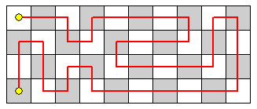

# Samantha Duong

Hello all,

I’ve got some practice problems for you that will give me insight into how I should shape the programming questions. Please do this and let me know how you like it:

Let T(n) be the number of PATHS over a 4×n playing board such that:

    • The path starts in the top left corner.
    • The path consists of moves that are up, down, left, or right one square.
    • The path visits each square exactly once.
    • The path ends in the bottom left corner.

The diagram shows one path over a 4×10 board:

T(10) is 2329. What is T(1012) modulo 108?
